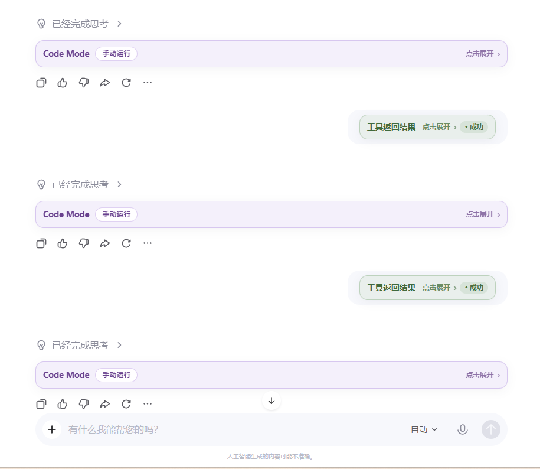
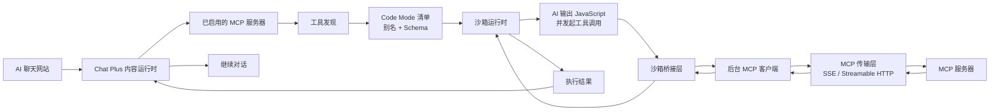

# Chat Plus

<p align="center">
  <a href="./README.md">English</a> | 简体中文
</p>

<p align="center">
  
</p>

<p align="center">
  <strong>面向 AI 聊天网站的适配器驱动式 MCP 编排扩展。</strong>
</p>

<p align="center">
  Chat Plus 可以把网页聊天 UI 接入 MCP 服务器与 Skills，在需要时重新注入系统指令，
  以受控沙箱执行工具工作流，并带着结果继续同一段对话。
</p>

<p align="center">
  <a href="#overview">概览</a> •
  <a href="#getting-started">快速开始</a> •
  <a href="#site-adapters">站点适配器</a> •
  <a href="#code-mode-and-mcp-orchestration">Code Mode</a> •
  <a href="#development">开发</a>
</p>

<a id="overview"></a>

## 概览

Chat Plus 是一个面向 AI 聊天网站的浏览器扩展。它位于页面、扩展运行时和你的 MCP 服务器之间，让模型能够发现工具、调用工具，并在拿到工具输出后继续同一段对话。

这个项目刻意采用适配器驱动设计。Chat Plus 不把宿主站点的逻辑硬编码进扩展核心，而是为每个站点使用一份独立的 JavaScript 适配器脚本。每个适配器都由一个必需的 `meta` 块以及四个必需钩子组成：`transformRequest`、`extractResponse`、`decorateBubbles` 和 `continueConversation`。

下面是一个典型的站内使用视图，展示了在受支持聊天网站中直接渲染在对话里的 Code Mode 卡片和工具结果反馈：

<p align="center">
  
</p>

<p align="center">
  <em>界面示例：聊天对话中的 Code Mode 执行块与工具返回状态。</em>
</p>

> [!IMPORTANT]
> Chat Plus 只会在存在有效站点适配器的标签页上工作。站点支持能力由适配器脚本提供，而不是由扩展核心直接内置。

> [!IMPORTANT]
> Chat Plus 会直接连接远程 `SSE` 与 `Streamable HTTP` MCP 端点。如果你的工具或 `SKILL.md` 工作流只存在于本地，请先通过 [MCP-Gateway](https://github.com/510myRday/MCP-Gateway) 将它们暴露出来。

## 为什么选择 Chat Plus

- 适配器优先的站点支持：每个宿主站点一份脚本，遵循固定的四钩子契约。
- 按标签页独立编排：每个页面可分别启用扩展、预设、服务器与工具。
- 原生 MCP 执行：从远程 MCP 服务器发现工具，并把它们暴露为模型可使用的结构化运行时。
- 自动续聊：工具运行完成后，Chat Plus 可以自动发送结果，或仅填入输入框供你审阅。
- 系统提示词重注入：当对话长度或 URL 变化需要时，重新应用已解析的系统指令。
- 沙箱执行：适配器和 Code Mode 都在隔离环境中运行，而不是直接运行在页面上下文。

## 工作原理

从高层来看，Chat Plus 会监听页面上的受支持聊天站点，把指令注入到出站请求中，从入站响应中提取助手输出，并在模型发出 Chat Plus 协议块或 Code Mode 块时做出响应。

关键点在于，Chat Plus 不把 MCP 当成一次性的传输调用。它会先从已启用的 MCP 服务器发现工具接口，把它们标准化为一个清单，再注入完整的已启用 `tools.*` 目录及其简短描述，并持续提供 `toolDocs.describe(ref)` 以按需查看单个工具的细节。随后模型就可以编写小型编排代码，串联多个工具、检查中间结果、重塑输出，并把更干净的最终结果返回到当前对话中。



典型执行流程如下：

1. Chat Plus 连接到已启用的 MCP 端点并发现其工具。
2. 这些工具会被标准化成带有稳定别名和输入 schema 的清单。
3. 已解析的指令集会被注入到当前活动标签页中。
4. 当模型决定使用工具时，它输出的是一个 JavaScript 代码块，而不是原始的 MCP 传输调用。
5. Chat Plus 在受限沙箱中执行这段代码。
6. 在沙箱内部，代码可以调用 `tools.<serverAlias>.<toolAlias>(args)`。
7. 沙箱通过桥接层把这些调用转发给后台 worker，由后台通过 `SSE` 或 `Streamable HTTP` 发起真正的 MCP 请求。
8. 结果先流回沙箱，再作为执行输出回到聊天对话里。

这就是 Chat Plus 的核心区别：MCP 工具在受控运行时里以可编程接口的形式暴露，而不仅仅是一些不透明的远程调用。

<a id="getting-started"></a>

## 快速开始

### 前置条件

- Node.js
- Chromium 系浏览器或 Firefox
- 至少一个受支持的 AI 聊天网站
- 该网站对应的站点适配器
- 一个或多个 MCP 服务器，可以是远程的，也可以通过 MCP-Gateway 暴露出来

### 安装与构建

```bash
npm install
npm run build
```

构建输出：

- `dist/chrome`
- `dist/firefox`

开发时使用：

```bash
npm run dev
```

### 加载扩展

| 浏览器 | 输出目录 | 加载方式 |
| --- | --- | --- |
| Chrome / Edge | `dist/chrome/` | 打开 `chrome://extensions`，启用开发者模式，然后选择 **加载已解压的扩展程序** |
| Firefox | `dist/firefox/` | 打开 `about:debugging`，选择 **This Firefox**，然后加载 `dist/firefox/manifest.json` |

> [!NOTE]
> Chat Plus 主要在 Chrome / Edge 上开发和测试。Firefox 仍然保留为独立 manifest 的源码构建目标，但 GitHub Releases 只发布 Chrome 安装包。

### 配置受支持站点

1. 打开目标聊天网站。
2. 打开 Chat Plus 侧边栏。
3. 进入 **Site**，为该宿主站点添加或编辑适配器脚本。
4. 进入 **Tools**，注册一个或多个 MCP 服务器。
5. 进入 **Orchestration**，启用当前标签页允许使用的工具。

当一个页面同时具备有效适配器、已启用工具以及可选的系统预设后，Chat Plus 就能注入指令、检测执行标记、运行 MCP 工具，并带着结果继续当前对话。

## 通过 MCP-Gateway 使用本地 MCP 与 Skills

Chat Plus 最擅长连接远程 MCP 端点。当某个服务器只存在于本地时，尤其是以 `stdio` 形式运行，或者只是一个本地 `SKILL.md` 工作流，推荐做法是在它前面加一层 [MCP-Gateway](https://github.com/510myRday/MCP-Gateway)。

推荐流程：

1. 通过 MCP-Gateway 运行本地 MCP 服务器或 skills。
2. 让网关把它们暴露成 `SSE` 或 `HTTP` 端点。
3. 在 Chat Plus 的 **Tools** 中注册这些生成出来的端点。
4. 在 **Orchestration** 中按标签页启用相应工具。

典型网关端点：

```text
http://127.0.0.1:8765/api/v2/sse/<serverName>
http://127.0.0.1:8765/api/v2/mcp/<serverName>
```

如果 MCP-Gateway 暴露了专门的 skills 端点，Chat Plus 也可以像消费其他远程 MCP 服务器一样使用它。

<a id="site-adapters"></a>

## 站点适配器

站点适配器是一份单独的 JavaScript 脚本，它必须 `return` 一个对象，其中包含一个必需的 `meta` 块和四个必需钩子：

```js
return {
  meta: {
    contractVersion: 2,
    adapterName: "Example Site",
    capabilities: {
      requestInjection: "json-body",
      responseExtraction: "json",
      protocolCards: "helper",
      autoContinuation: "dom-plan",
    },
  },
  transformRequest(ctx) {},
  extractResponse(ctx) {},
  decorateBubbles(ctx) {},
  continueConversation(ctx) {},
};
```

这四个必需钩子，就是让一个网站能够在 Chat Plus 中正常工作的核心契约：

- `transformRequest(ctx)`：在可以可靠修改请求体时，把系统指令或待发送的工具结果负载注入到出站请求中。
- `extractResponse(ctx)`：从真实响应结构中提取助手文本，必要时也包括协议块。
- `decorateBubbles(ctx)`：重写消息 DOM 快照，使注入的协议文本被隐藏，而可见的 `toolCall`、`toolResult` 或 `codeMode` 块以 UI 形式渲染，而不是裸协议文本。适配器必须使用 `ctx.helpers.ui.decorateProtocolBubbles(...)`。
- `continueConversation(ctx)`：返回一个 DOM 计划，告诉 Chat Plus 如何把 `ctx.continuationText` 放回输入框并触发发送。适配器必须使用 `ctx.helpers.plans.dom(...)`。

适配器的重要行为约束：

- `decorateBubbles(ctx)` 和 `continueConversation(ctx)` 运行在 DOM 快照沙箱中，不会直接操作真实页面。
- `continueConversation(ctx)` 应该返回一个 DOM 策略对象，而不是自己去点击按钮或派发事件。
- `transformRequest(ctx)` 即使面对加密或不透明载荷也依然是必需的；在这种情况下它可以安全地 `return null`。Chat Plus 仍会保留四钩子契约，并在用户发送前通过 `continueConversation(ctx)` 计划退回到 DOM 预填充方式。
- 如果响应同时包含普通助手文本和协议块，适配器应该保留普通文本，只转换协议部分。
- 如果目标站点改了请求字段、响应结构或 DOM 形状，通常应该修复适配器脚本，而不是修改扩展核心。
- 沙箱提供了 `ctx.helpers.protocol.*`、`ctx.helpers.ui.*` 和 `ctx.helpers.plans.*` 等共享 helper 命名空间；新适配器应复用这些能力，而不是在每个站点里重复造轮子。

### 适配器开发工作流

这个仓库在 [`chat-plus-adapter-debugger-skill/SKILL.md`](chat-plus-adapter-debugger-skill/SKILL.md) 中提供了一个专门面向适配器作者的工作流。

如果你正在开发或修复一个适配器，推荐流程是：

1. 把 [`chat-plus-adapter-debugger-skill/SKILL.md`](chat-plus-adapter-debugger-skill/SKILL.md) 当作主要契约和审查清单。
2. 当你需要来自真实网站的现场证据时，在用户明确允许页面调试后使用 `chrome-cdp` skill。
3. 在编写或修复选择器和字段路径之前，先采集真实的请求负载、响应或流式负载、输入框 DOM 和发送动作。
4. 只有在这些样本都确认后，再生成或修复适配器。

这个工作流存在的目的，就是让适配器开发建立在证据之上，而不是靠猜：

- 检查真实请求负载
- 检查真实响应或流式负载
- 检查真实聊天 DOM
- 确认真实输入框和发送动作
- 生成或修复真正满足 Chat Plus 适配器契约的脚本

仓库中的 `web_chat_js/` 还包含了已迁移的示例适配器，覆盖 ChatGPT、Gemini、Google AI Studio、豆包、Qwen Chat、Arena、小米 Mimo 和 Z.ai。请把它们视为当前 helper 契约下的具体示例，而不是替代真实样本采集的捷径。

如果你要为一个新网站开发支持，请先从 skill 和真实样本开始，而不是根据站点名称去猜请求路径、响应字段或选择器。

<a id="code-mode-and-mcp-orchestration"></a>

## Code Mode 与 MCP 编排

Code Mode 为模型提供了一条受控的 JavaScript 工具编排执行路径。

Chat Plus 不要求模型只能发出单个原始 MCP 调用，而是可以把已启用工具暴露成结构化清单，让模型在沙箱中编写一小段 JavaScript。那段代码可以调用一个或多个工具、检查结果、组合结果，并在扩展把结果送回对话前，通过 `return` 返回一个更干净的最终值。

Code Mode 提供的能力：

- 通过 `tools.<serverAlias>.<toolAlias>(args)` 访问已启用 MCP 工具
- 自动注入工具目录，列出每个已启用 `tools.*` 条目及其简短说明
- `toolDocs.describe(ref)` 可在需要 schema、调用模板或使用说明时查看单个工具的详细文档
- 支持 `await`、`Promise.all`、`console.log(...)`、结构化 `return` 和常规 JavaScript 数据整形
- 一条从沙箱到后台再到 MCP 的桥接链路，因此模型不需要处理底层传输细节
- 执行后自动续聊，或者在关闭自动发送时仅填充输入框

运行时会发生的事情：

1. Chat Plus 从已启用服务器中发现工具。
2. 它把这些工具转成带别名和 schema 的清单，然后注入完整的已启用工具目录及简短描述。
3. 模型从目录中选工具，必要时调用 `toolDocs.describe(ref)` 查看某个工具的完整文档，再针对暴露出来的运行时编写 JavaScript。
4. 沙箱执行这段代码。
5. 每次 `tools.*` 调用都会被转发给后台 MCP 客户端。
6. MCP 结果先回到沙箱。
7. 最终执行输出再返回到当前对话中。

Code Mode 不允许的内容：

- 直接访问 DOM
- `window`、`document`、`fetch`、`XMLHttpRequest`、`chrome` 或 `browser`
- `import` / `export`
- 任意第三方库

这部分能力，正是 Chat Plus 把 MCP 工具从“薄连接器”提升为“可编程运行时”的关键。

<a id="development"></a>

## 开发

### 命令

| 命令 | 用途 |
| --- | --- |
| `npm run dev` | 本地 Chrome 开发的 watch 模式 |
| `npm run build` | 清理、类型检查，并构建 Chrome + Firefox 包 |
| `npm run build:chrome` | 仅构建 Chrome 包 |
| `npm run build:firefox` | 仅构建 Firefox 包 |
| `npm run release:build:chrome` | 构建并打包供 GitHub Releases 使用的 Chrome 发布 ZIP |
| `npm run typecheck` | 运行 TypeScript 类型检查但不输出构建产物 |
| `npm run version:set -- x.y.z` | 更新扩展版本号 |
| `npm run version:sync` | 同步 package 与 manifest 中的版本号 |

### 项目结构

```text
src/
├─ background/          # MCP 客户端、连接池、发现与工具调用
├─ content/             # 注入状态、续聊、Code Mode、界面组件
├─ page-monitor/        # 页面上下文中的请求/响应拦截
├─ sandbox/             # 适配器与 Code Mode 沙箱执行器
├─ sidepanel/           # React 侧边栏 UI
├─ mcp/                 # MCP 配置辅助与清单生成
├─ system-instructions/ # 预设与解析逻辑
└─ shared/              # 共享协议标记与工具函数
```

这个仓库为 Chrome 和 Firefox 分别提供了独立的浏览器 manifest，同时让适配器、编排和 MCP 运行时逻辑保持共享。

## 许可证

Chat Plus 采用 **GPL v3 或更高版本** 开源。如果你在符合 GPL 要求的开源工作流中使用它，请遵守 [`LICENSE`](LICENSE) 中的条款。

如果你需要商业用途、专有集成，或希望避免 GPL 的传染性义务，请联系维护者获取单独的商业许可。
